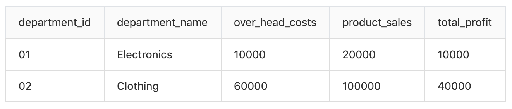

# bamazon
#### A simple app where you'll be creating an Amazon-like storefront with the MySQL. The app will take in orders from customers and deplete stock from the store's inventory. The app will also track product sales across your store's departments and then provide a summary of the highest-grossing departments in the store.


# Tools needed for the APP

## - dotenv
Dotenv is a zero-dependency module that loads environment variables from a .env file into process.env. Storing configuration in the environment separate from code is based on The Twelve-Factor App methodology.
https://www.npmjs.com/package/dotenv


## - inquirer
A collection of common interactive command line user interfaces.
https://www.npmjs.com/package/inquirer


## - mysql
This is a node.js driver for mysql. It is written in JavaScript, does not require compiling, and is 100% MIT licensed.
https://www.npmjs.com/package/mysql


## - Chalk 
Chalk is a Terminal string styling done right.
https://www.npmjs.com/package/chalk


## - Table
Table is an npm package that produces a string that represents array data in a text table.


# -Instruction 

## 1 - clone the repo

## 2 - run `npm install`

## 3 - create a file named .env, add the following to it, replacing the values with your MySql setup (no quotes) once you have them

```# MySql setup

DB_HOST=localhost
DB_USER=root
MYSQL_PASSWORD=YourPasswordIfYouDidSetOn
DB_DATABASE=bamazon
```
* This file will be used by the `dotenv` package to set what are known as environment variables to the global `process.env` object in node. These are values that are meant to be specific to the computer that node is running on, and since we are gitignoring this file, they won't be pushed to github — keeping our password information private.

   * If someone wanted to clone your app from github and run it themselves, they would need to supply their own `.env` file for it to work.

### Make sure you save and require the MySQL and Inquirer npm packages in your files--your app will need them for data input and storage.

# #1: Customer View

1. Create a MySQL Database called ```bamazon```.


2. Then create a Table inside of that database called ```products```.


3. The products table should have each of the following columns:


    * item_id (unique id for each product)


    * product_name (Name of product)


    * department_name


    * price (cost to customer)


    * stock_quantity (how much of the product is available in stores)


4. Populate this database with around 10 different products. (i.e. Insert "mock" data rows into this database and table).


5. Then create a Node application called ```bamazonCustomer.js```. Running this application will first display all of the items available for sale. Include the ids, names, and prices of products for sale.


6. The app should then prompt users with two messages.

    * The first should ask them the ID of the product they would like to buy.
    * The second message should ask how many units of the product they would like to buy.


7. Once the customer has placed the order, your application should check if your store has enough of the product to meet the customer's request.

    * If not, the app should log a phrase like ```Insufficient quantity!```, and then prevent the order from going through.


8. However, if your store does have enough of the product, you should fulfill the customer's order.

    * This means updating the SQL database to reflect the remaining quantity.
    * Once the update goes through, show the customer the total cost of their purchase.


# #2: Manager View

1. Create a new Node application called ```bamazonManager.js```. Running this application will:


    * List a set of menu options:


        * View Products for Sale


        * View Low Inventory


        * Add to Inventory


        * Add New Product


2. If a manager selects ```View Products for Sale```, the app should list every available item: the item IDs, names, prices, and quantities.


3. If a manager selects ```View Low Inventory```, then it should list all items with an inventory count lower than five.


4. If a manager selects ```Add to Inventory```, your app should display a prompt that will let the manager "add more" of any item currently in the store.


5. If a manager selects ```Add New Product```, it should allow the manager to add a completely new product to the store.


# #3: Supervisor View

1. Create a new MySQL table called ```departments```. Your table should include the following columns:


    * department_id


    * department_name


    * over_head_costs (A dummy number you set for each department)


2. Modify the products table so that there's a product_sales column, and modify your ```bamazonCustomer.js``` app so that when a customer purchases anything from the store, the price of the product multiplied by the quantity purchased is added to the product's product_sales column.

    * Make sure your app still updates the inventory listed in the ```products``` column.


3. Create another Node app called ```bamazonSupervisor.js```. Running this application will list a set of menu options:


    * View Product Sales by Department


    * Create New Department


4. When a supervisor selects ```View Product Sales by Department```, the app should display a summarized table in their terminal/bash window. Use the table below as a guide.


5. The ```total_profit``` column should be calculated on the fly using the difference between ```over_head_costs``` and ```product_sales```. ```total_profit``` should not be stored in any database. You should use a custom alias.


6. If you can't get the table to display properly after a few hours, then feel free to go back and just add ```total_profit``` to the ```departments``` table.


    * Hint: You may need to look into aliases in MySQL.


    * Hint: You may need to look into GROUP BYs.


    * Hint: You may need to look into JOINS.


    * _HINT_: There may be an NPM package that can log the table to the console. What's is it? Good question :)